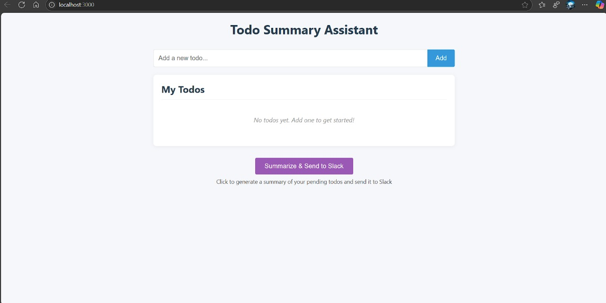

# Todo Summary Assistant

This project is a full-stack application enabling users to manage personal to-do items and generate summaries using a Large Language Model (LLM). The generated summary can then be dispatched to a designated Slack channel.

## Features

* **To-Do Management**: Create, add, edit, and delete to-do items[cite: 3].
* **LLM Integration**: Summarize pending to-dos using a real LLM (e.g., OpenAI, Cohere)[cite: 2, 8].
* **Slack Integration**: Send generated summaries to a Slack channel via Incoming Webhooks[cite: 3, 10].
* **Status Messages**: Display success or failure messages for Slack operations[cite: 5].

## Technologies

* **Frontend**: React [cite: 13]
* **Backend**: Java (Spring Boot) or Node.js (Express) [cite: 5, 14]
* **Database/Hosting**: Supabase, Firebase, PostgreSQL (flexible) [cite: 11, 12]
* **LLM**: OpenAI, Cohere, or similar [cite: 2, 8]
* **Messaging**: Slack Incoming Webhooks [cite: 10]

## Setup Guide

### Prerequisites

Ensure you have Node.js, npm/yarn, Git, and a JDK (for Java backend) installed. API keys for your chosen LLM provider and a Slack Incoming Webhook URL are also required.

### Configuration

Create `.env` files (for Node.js) or configure `application.properties`/`application.yml` (for Java) in the respective frontend and backend directories. These files should include:

* `REACT_APP_API_BASE_URL`: Backend API endpoint.
* `DATABASE_URL` (or equivalent for Java): Your database connection string.
* `LLM_API_KEY`: Your LLM provider API key[cite: 8].
* `SLACK_WEBHOOK_URL`: Your Slack Incoming Webhook URL[cite: 10].

### Running the Application

1.  **Frontend**: Navigate to the `frontend` directory, run `npm install` (or `yarn install`), then `npm start` (or `yarn start`).
2.  **Backend (Node.js)**: Navigate to the `backend-nodejs` directory, run `npm install` (or `yarn install`), then `npm start` (or `yarn start`).
3.  **Backend (Java)**: Navigate to the `backend-java` directory, build with `./mvnw clean install`, then run with `./mvnw spring-boot:run`.

## Screenshots

### Dashboard

![Dashboard Image]

### To-Do Add

![To-Do Add Image]

### To-Do Delete

![To-Do Delete Image]
